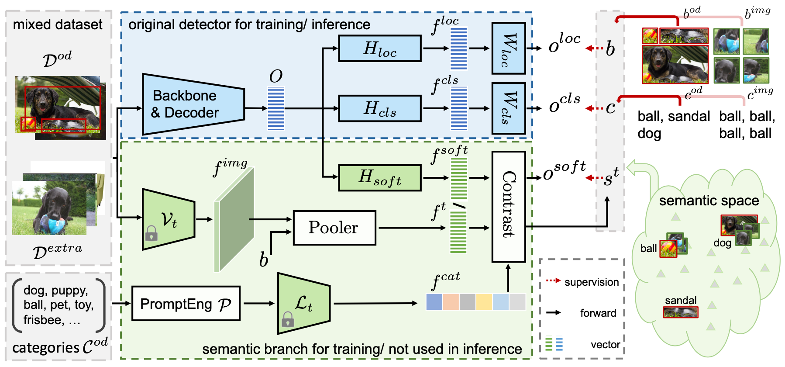

# Learning from Rich Semantics and Coarse Locations for Long-tailed Object Detection

[](https://paperswithcode.com/sota/object-detection-on-lvis-v1-0-val?p=learning-from-rich-semantics-and-coarse)

[NeruIPS23] This is the official implementation of the paper "[Learning from Rich Semantics and Coarse Locations for Long-tailed Object Detection](https://arxiv.org/abs/2310.12152)". 

## Introduction

In this paper, we propose RichSem, a simple but effective method, which is robust to learn rich semantics from coarse locations without the need of accurate bounding boxes. RichSem leverages rich semantics from images, which are then served as additional “soft supervision” for training detectors. Specifically, we add a semantic branch to our detector to learn these soft semantics and enhance feature representations for long-tailed object detection. The semantic branch is only used for training and is removed during inference.

## Model ZOO

### RichSem with ResNet-50 on LVIS

| Model  | Backbone | Extra data| Epochs | Box AP | Box AP^r | Config | Download |
| ------ | -------- |-------- | ------- | ------ | ------ | ----- | ----- |
| RichSem | R50 | INet-LVIS |24 | 37.1 | 29.9 |[config](config/RichSem/richsem_4scale.py) | [model]() |
| RichSem | R50 ([21k pretrained](https://miil-public-eu.oss-eu-central-1.aliyuncs.com/model-zoo/ImageNet_21K_P/models/resnet50_miil_21k.pth)) | INet-LVIS | 24 | 40.1 | 36.1 | [config](config/RichSem/richsem_4scale.py) | [model]() |


## Running
### Install

```
pip install numpy==1.21.6
pip install scipy termcolor addict yapf timm==0.5.4 lvis pycocotools ftfy regex PyWavelets
python -m pip install 'git+https://github.com/facebookresearch/detectron2.git'
cur_dir=$(pwd)
cd models/dino/ops
python setup.py build install --user
cd $(pwd)
```

### Data
The LVIS dataset and ImageNet dataset should be organized as:
We preprocess ImageNet-21k to obtain imagenet_lvis_image_info.json following [Detic](https://github.com/facebookresearch/Detic/blob/main/tools/create_imagenetlvis_json.py).
We also provide an already processed [imagenet_lvis_image_info.json]().

```
RichSem
└── data
    └── DATASET
        imagenet-lvis
        ├── imagenet_lvis_image_info.json
        ├── images
    └── lvis_v1
        ├── annotations
        │      ├── lvis_v1_train.json
        │      └── lvis_v1_val.json
        ├── train2017
        └── val2017        
```

### Training
Train RichSem + ResNet-50 with 8 GPUs:
```
bash scripts/richsem_dist.sh 8 --output_dir OUTPUT/RichSem/R50 -c config/RichSem/richsem_4scale.py --data_path <data_path> --options dn_box_noise_scale=1.0
```
### Testing
Test RichSem + ResNet-50 with 8 GPUs, and evaluate:
```
bash scripts/richsem_dist.sh 8 --output_dir OUTPUT/RichSem/R50 -c config/RichSem/richsem_4scale.py --data_path <data_path> --eval --resume <ckpt_path>
```

## Acknowledgement
Many thanks to these excellent opensource projects
* [DINO](https://github.com/IDEA-Research/DINO)  
* [CLIP](https://github.com/openai/CLIP) 

## Citation

If you find this project useful for your research, please use the following BibTeX entry.
```bibtex
@inproceedings{meng2023learning,
  title={Learning from Rich Semantics and Coarse Locations for Long-tailed Object Detection},
  author={Meng, Lingchen and Dai, Xiyang and Yang, Jianwei and Chen, Dongdong and Chen, Yinpeng and Liu, Mengchen and Chen, Yi-Ling and Wu, Zuxuan and Yuan, Lu and Jiang, Yu-Gang},
  booktitle={Thirty-seventh Conference on Neural Information Processing Systems},
  year={2023}
}```